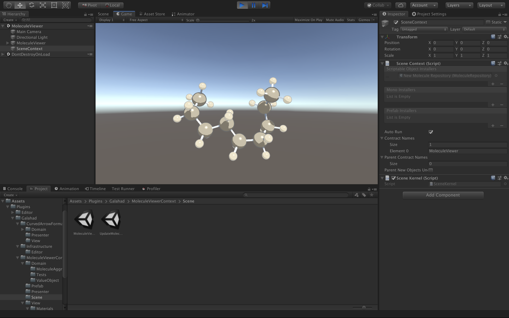
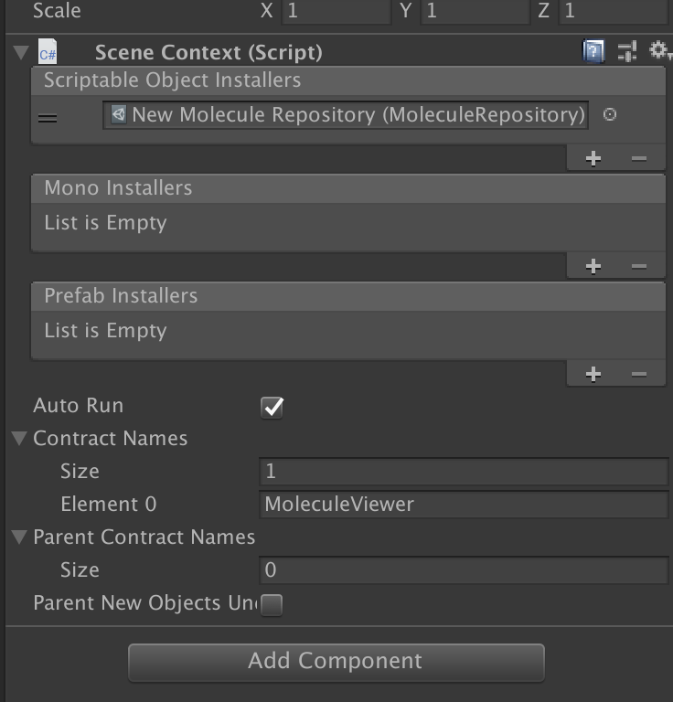
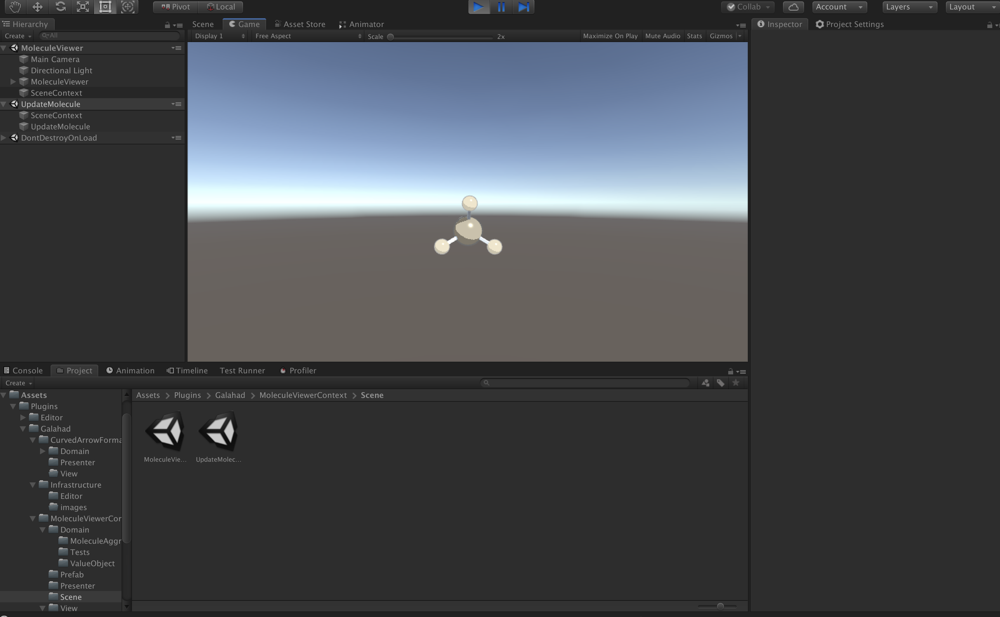
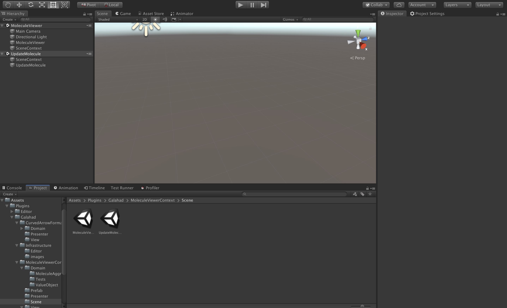

# Molecule Viewer Context

分子描画機能コンテキスト

## Scene

### MoleculeViewer.unity

分子描画用シーン




分子のデータ保存用のスクリプタブルオブジェクトのMoleculeRepositoryから分子を読み込んで描画する。



MoleculeRepositoryは、Zenjectを使ってSceneContextからDIする。


### MoleculeViewer.unity

分子の状態更新用シーン



先のMoleculeViewer.unityを親シーンに追加してマルチシーン構成にして使う。



JSONで外部サーバーと通信してMoleculeRepository内の分子の構造をアップデートする。
pythonでのサーバーの立て方はhttps://gist.github.com/f2e7b2efc68309bd751d756e2ded4d7b のipythonファイルを参考にしてください。


# 構成

UniRxを用いたMV(R)Pパターン
データのDIはZenjectで行う
DDDでの開発を目指す

## Model(DDDのDomain)

出来るだけドメイン側の言葉を使ってクラスを作っている（有機化学寄り）。
区別できるものはEntity、性質を表すものはValueObjectでクラスとして表す。
DDDでは基本的にプリミティブ型は直接扱わずに、クラスを作ってそれを扱う。
ただし、集約間やのやり取りは
原子や結合は原理的に区別できないが、ここでは区別できるものとして考え、識別子をあてている。

### 分子集約(MoleculeAggregate)

分子の集約。
シリアライズなどはこれを単位に行う。
整合性の単位でもあるので、テストなどもこれを単位に行う。

- Molecule <<AggregateRouteEntity>>
    - Atoms
        - Atom
    - Bonds
        - Bond
- MoleculeRepository

スクリプタブルオブジェクトのMoleculeRepositoryに保持している分子モデルを読み込む
スクリプタブルオブジェクトは[Create]->[MoleculeRepository]から生成できて、インスペクタ上で編集が可能
(サンプルがAssets/Plugin/Galahad/Infrastructureに入っている)
JSONでのやり取りも可能。

JSON形式の例
```json
{"title": "test", 
    "atoms": [
        {"atomicNumber": 6, 
            "atomIndex": 0, 
            "position": {"x": -0.001223418587715074, "y": 0.007370108001782259, "z": 0.005682186742367829}, 
            "formalCharge": 0}, 
        {"atomicNumber": 1, 
            "atomIndex": 1, 
            "position": {"x": -0.6273807852439662, "y": -0.8325610053795247, "z": -0.32903345831345765}, 
            "formalCharge": 0}, 
        {"atomicNumber": 1, 
            "atomIndex": 2, 
            "position": {"x": -0.4737979629666024, "y": 0.9499673265354147, "z": -0.3111252648001735}, 
            "formalCharge": 0}, 
        {"atomicNumber": 1, 
            "atomIndex": 3, 
            "position": {"x": 0.11345075954201757, "y": -0.046872478286756815, "z": 1.0979031234409031}, 
            "formalCharge": 0}, 
        {"atomicNumber": 1, 
            "atomIndex": 4, 
            "position": {"x": 0.9889514072562662, "y": -0.07790395087091563, "z": -0.4634265870696401}, 
            "formalCharge": 0}], 
    "bonds": [
        {"bondIndex": 0, 
            "beginAtomIndex": 0, 
            "endAtomIndex": 1, 
            "bondOrder": 1}, 
        {"bondIndex": 1, 
            "beginAtomIndex": 0, 
            "endAtomIndex": 2, 
            "bondOrder": 1}, 
        {"bondIndex": 2, 
            "beginAtomIndex": 0, 
            "endAtomIndex": 3, 
            "bondOrder": 1}, 
        {"bondIndex": 3, 
            "beginAtomIndex": 0, 
            "endAtomIndex": 4, 
            "bondOrder": 1}], 
    "offsetPosition": {"x": 0, "y": 0, "z": 0}}
```


DIするのでエディタ上にSceneContextオブジェクトを作成してインスペクタ上で設定する。

## (Reactive)Presenter

MoleculeViewerにMoleculeRepositoryをDIしてその情報を元に分子を生成する。
Domainイベントに対する処理はここで記述する。

- MoleculeViewer
    - MoleculePresenter
        - AtomPresenter
        - BondPresenter

生成にAtomPrefab,BondPrefab,AtomColorPaletteを使うので、Editor上でMoleculeViewerクラスのインスペクタに設定する。

- MoleculeUpdateService

MoleculeRepositoryをHTTP通信から得たJSONで更新する。
サンプルでは独立性を取るために、マルチシーン構成で実行している。
シーン間で同じMoleculeRepositoryをDIする必要があるが、Zenjectの機能でできる。


## View

Unityの場合、GameObject(Prefab)などEditor上で編集できるので、明確にViewに分類できないことが多いが、表示関連をここに書く。

### Prefab

#### Atom

原子を表示するGameObjectのPrefab。MoleculeViewerクラスにインスペクタ上に設定して使う。
ローポリ、カリング用のPrefabも追加させる予定。

#### Bond

結合をを表示するGameObjectのPrefab。
BondPresenterを保持する以上の意味はない。
当たり判定を取りたい場合はRigidBodyが必要。

### ScriptableObject

#### AtomColorPalette

原子ごとのMaterialを設定する。
[Create]->[AtomColorPalette]から作成できる。


