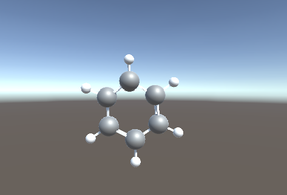

# Galahad

Library for working with molecules (espetially small molecules) on Unity.

## libraries

A function library (RDKitWrapper.dll(.so)) using RDKit is used to load and optimize molecules.

**Currently supported architectures**
- Windows 10 x64
- Audroid arm64
